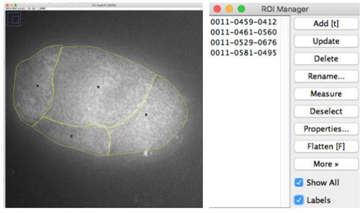

# Image Annotation

In this step, the structures of interest, e.g. cell and nuclei, are outline in
the images to generate data that will be used to train the neural network.

For the moment, we support annotations from [**FIJI**](https://fiji.sc/).
Using annotations from other software packages is in principle possible but
will require the implementation of dedicated wrappers.


## File organization
Data has to be split into two folders **train**, **valid**, and **test**.
The `train` folder will be used to train the neural network, the `valid` folder
to continuously monitor how well the training worked. Both folders have to contain
images and annotations. The `test` folder can then be used to test the trained
network. It only needs to contain images that should be segmented.

The example below show the folder structure with a
few annotated images. For more details see our [**deep learning primer**](deeplearning.md).

```
.
├─ test/
│  ├─ C1-img30.tif
│  ├─ C1-img31.tif
│  ...
├─ train/
│  ├─ C1-img4.tif
│  ├─ C1-img4__RoiSet.zip
│  ├─ C1-img5.tif
│  ├─ C1-img5__RoiSet.zip
│  ...
├─ valid/
│  ├─ C1-img1.tif
│  ├─ C1-img1__RoiSet.zip
│  ├─ C1-img2.tif
│  ├─ C1-img2__RoiSet.zip
.
```

There is no simple rule for how many images / annotated cells or nuclei you will need
to obtain good results. As an example, for standard segmentation of adherent cells, we obtained
good results with a training set of 5 images (with up to 10-15 cells per image),
and test set of 2 images. For more challening data-sets, you can add more training
data if you see that the performance is not satisfying with the current training
data set.

## Annotation with FIJI

FIJI allows to annotate images, and save the annotations into a separate file.



1.  Open FIJI
2.  Open the **ROI manager**: `Analyze` > `Tools` > `ROI manager`
3.  Open image that you will annotate.
4.  Select the annotation tool of choice, e.g. freehand or polygon.
5.  Outline first structure of interest. When done, press `Add(t)` in ROI manager to
    add outline.
6.  Proceed with all other structures. Enabling "Show all", will show all defined regions.
7.  Save regions by highlighting all regions in the list and pressing on `More` > `Save ...`

    - If only one region is saved, this will created a file with the extension `.roi`.
    - If multiple annotations are saved this will create a `.zip` file.
    - As a file-name choose the name of the annotated image, followed by a
    suffix such as **`_RoiSet.zip`**. If you have different structures
    (e.g. nuclei and cells), choose the suffix accordingly, e.g.
    `_cells_RoiSet.zip` and `_nuclei_RoiSet.zip`.

**IMPORTANT**: all structures, e.g. nuclei, have to be annotated. Unwanted elements,
e.g. nuclei touching the cell border, can be removed in a post-processing step.


## Convert annotations to images

Once you have annotated the images, you have to convert these annotations to images which
can be used as an input for the A-net. We provide a dedicated ImJoy
plugin to perform this task. This plugin has different **tags**, which render the plugin
 for a given segmentation tasks. You only have to specify a few key properties of your data.

The screenshot shown below shows the plugin interface for the segmentation of the
cell membrane in the example data. Note that here we only have one channel.


For the example above, you have to specify

1. Unique identifier for each channel (here there is only one channel with the identifier `C3-`)
2. File extension of your images (`.tif` in this case)
3. File extension of the annotations (FIJI annotations with `_RoiSet.zip`)

Once you specified these parameters you can convert an entire folder with annotations
by pressing on the plugin itself (the blue text `AnnotationImporter`). You will be
asked to specify the parent folder containing the different data-sets.

The plugin will open all annotation files, create the necessary mask images, and
save them together with the corresponding images in a new folder `unet_data` in
the processed folder. It contains two subfolders **train** and **valid**. Here,
a dedicated folder with the name of the image is created. The actual images are
then named with the channel identifier (e.g. `cells`) and the image masks with
the channel identifier followed by the mask type (e.g. `cell_mask_edge.png`).

```
.
├─ test/
│  ...
├─ train/
│  ...
├─ valid/
│  ...
├─ unet_data/
│  ├─ train/
│  │  ├─ C3-img4
│  │  │  ├─ cells.png
│  │  │  ├─ mask_edge.png
│  │  ├─ C3-img5
│  │  │  ├─ cells.png
│  │  │  ├─ mask_edge.png
│  │  ...
│  ├─ valid/
│  │  ├─ C3-img1
│  │  │  ├─ cells.png
│  │  │  ├─ mask_edge.png
│  │  ├─ C3-img2
│  │  │  ├─ cells.png
│  │  │  ├─ mask_edge.png
```


This directory can be used as an input directory for the training. It will also create a `.zip` file
that can be easily distributed.

### Defining a root folder
By default, ImJoy will open files in your home folder. If your data is at a different
location, you can set a root folder. Each time you specify a file, ImJoy will open
the file-dialog in this root folder. Press the button `Root folder` and specify the
desired folder. The specified root folder is also saved, and will be resused the next time you launch
ImJoy.
